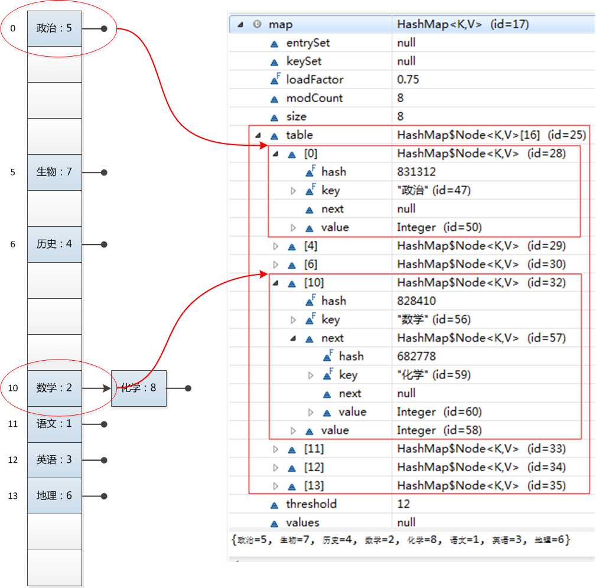

##Java 进阶知识 

####集合

ArrayList、LinkedList、Hashtable、HashMap、ConcurrentHashMap、HashSet 实现原理

- HashMap  实现原理 
[美团：Java 8系列之重新认识HashMap](https://tech.meituan.com/java_hashmap.html)
[Java HashMap原理解析](https://yikun.github.io/2015/04/01/Java-HashMap%E5%B7%A5%E4%BD%9C%E5%8E%9F%E7%90%86%E5%8F%8A%E5%AE%9E%E7%8E%B0/)

- HashMap 1.7-1.8的变化区别 
- 线程不安全的问题(死循环)

- HashTable 实现原理 

- ConcurrentHashMap 实现原理  
- ConcurrentHashMap 1.7-1.8的区别

- HashTable与ConcurrentHashMap的区别

####多线程 

- ThreadLocal 实现原理、应用场景、避免的问题

- 

